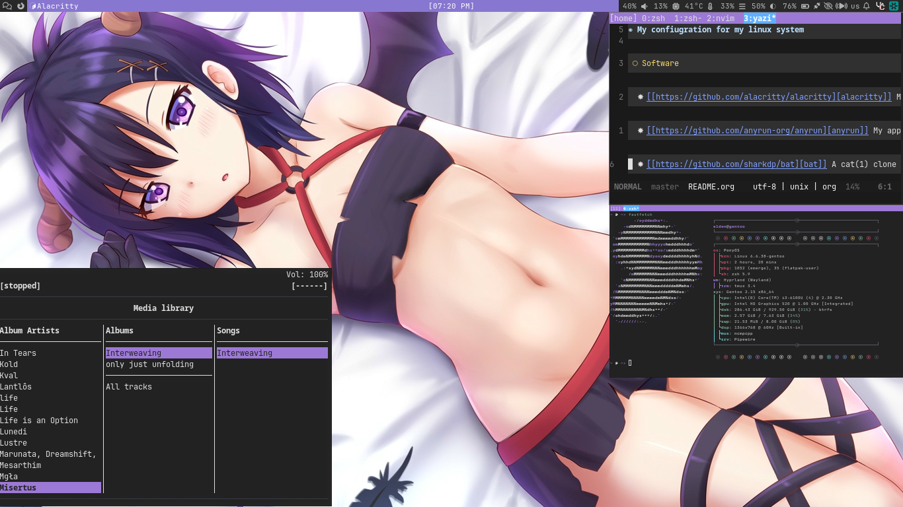

# My confiugration for my linux system

## Software
   My terminal emulator (with the graphics patch) [alacritty](https://github.com/alacritty/alacritty)

   My application launcher [anyrun](https://github.com/anyrun-org/anyrun)

   A cat(1) clone with syntax highlighting [bat](https://github.com/sharkdp/bat)

   A top clone with an interactive mode [btop](https://github.com/aristocratos/btop)

   My init system [dinit](https://github.com/davmac314/dinit)

   My image editor [gimp](https://gitlab.gnome.org/GNOME/gimp)

   My window manager [sway](https://github.com/swaywm/sway)

   My password manager [keepassxc](https://github.com/keepassxreboot/keepassxc)

   My web browser [firefox](https://archive.mozilla.org/pub/firefox/releases)
   
   My music server [MPD](https://github.com/MusicPlayerDaemon/MPD)
   
   My music client [rmpc](https://github.com/mierak/rmpc)
   
   My media player [mpv](https://github.com/mpv-player/mpv)
   
   A soulseek client [nicotine](https://github.com/nicotine-plus/nicotine-plus)
   
   My email client [neomutt](https://github.com/neomutt/neomutt)
   
   My text editor [neovim](https://github.com/neovim/neovim)
   
   My screen video recorder [obs](https://github.com/obsproject/obs-studio)
   
   My notification daemon [swaync](https://github.com/ErikReider/SwayNotificationCenter)
   
   My torrent client [rustmission](https://github.com/intuis/rustmission)
   
   My discord client mod for firefox [vencord](https://github.com/Vendicated/Vencord)
   
   My status bar [waybar](https://github.com/Alexays/Waybar)
   
   My file manager [yazi](https://github.com/sxyazi/yazi)
   
   My PDF viewer [zathura](https://github.com/pwmt/zathura)

## Screenshots
   
